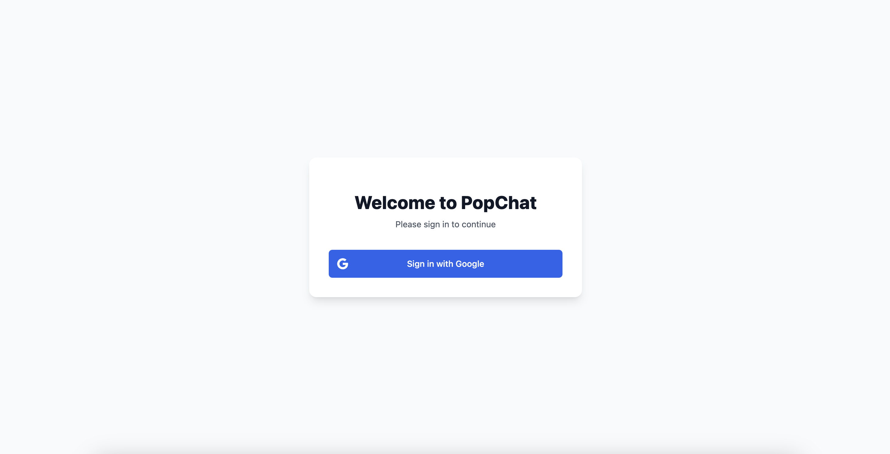

# PopChat

PopChat is a modern, real-time chat application that leverages multiple AI language models to provide intelligent conversations. Built with Next.js 14, TypeScript, and Tailwind CSS, it offers a seamless and responsive user experience with support for multiple AI models.

## Screenshots

### Main Chat Interface

*The main chat interface showing the conversation with AI model responses and markdown support*

### Model Selection

*Model selection interface with detailed information about each AI model*

### Chat History

*Sidebar showing chat history with delete functionality*

### Response Information

*Detailed model information and processing metrics for each response*

### Authentication

*Secure Google authentication interface*

## Features

- 🤖 **Multiple AI Model Support**
  - DeepSeek AI (7B parameters)
  - Meta LLaMA 3 (70B parameters)
  - Google Gemma (7B parameters)

- 🔒 **Secure Authentication**
  - Google Sign-In integration
  - Protected routes and conversations
  - User-specific chat history

- 💬 **Advanced Chat Capabilities**
  - Real-time streaming responses
  - Markdown support with syntax highlighting
  - Code block formatting
  - Thinking state visualization
  - Processing time tracking

- 📊 **Detailed Model Information**
  - Model parameters and configurations
  - Response processing time
  - Provider information
  - Real-time performance metrics

- 🎨 **Modern UI/UX**
  - Responsive design
  - Dark/Light mode support
  - Clean and intuitive interface
  - Smooth animations and transitions

## Tech Stack

- **Frontend**: Next.js 14, React, TypeScript
- **Styling**: Tailwind CSS, Tailwind Typography
- **Authentication**: Firebase Auth
- **Database**: Firebase Firestore
- **AI Integration**: Replicate API
- **State Management**: React Hooks
- **Deployment**: Vercel

## Getting Started

### Prerequisites

- Node.js 18+ and npm
- Firebase account
- Replicate API key

### Installation

1. Clone the repository:
```bash
git clone https://github.com/popand/popchat.git
cd popchat
```

2. Install dependencies:
```bash
npm install
```

3. Create a `.env` file in the root directory with the following variables:
```env
# Firebase Configuration
NEXT_PUBLIC_FIREBASE_API_KEY=your_firebase_api_key
NEXT_PUBLIC_FIREBASE_AUTH_DOMAIN=your_firebase_auth_domain
NEXT_PUBLIC_FIREBASE_PROJECT_ID=your_firebase_project_id
NEXT_PUBLIC_FIREBASE_STORAGE_BUCKET=your_firebase_storage_bucket
NEXT_PUBLIC_FIREBASE_MESSAGING_SENDER_ID=your_firebase_messaging_sender_id
NEXT_PUBLIC_FIREBASE_APP_ID=your_firebase_app_id

# Replicate API Configuration
REPLICATE_API_TOKEN=your_replicate_api_token
```

4. Run the development server:
```bash
npm run dev
```

5. Open [http://localhost:3000](http://localhost:3000) in your browser.

## Firebase Setup

1. Create a new Firebase project
2. Enable Authentication with Google provider
3. Create a Firestore database
4. Set up the following Firestore rules:
```javascript
rules_version = '2';
service cloud.firestore {
  match /databases/{database}/documents {
    match /chats/{chatId} {
      allow read, write: if request.auth != null && request.auth.uid == resource.data.userId;
    }
  }
}
```

## Deployment

The application can be easily deployed to Vercel:

1. Push your code to GitHub
2. Connect your repository to Vercel
3. Add the environment variables in Vercel's project settings
4. Deploy!

## Contributing

Contributions are welcome! Please feel free to submit a Pull Request.

1. Fork the repository
2. Create your feature branch (`git checkout -b feature/AmazingFeature`)
3. Commit your changes (`git commit -m 'Add some AmazingFeature'`)
4. Push to the branch (`git push origin feature/AmazingFeature`)
5. Open a Pull Request

## License

This project is licensed under the MIT License - see the [LICENSE](LICENSE) file for details.

## Acknowledgments

- [Next.js](https://nextjs.org/)
- [Tailwind CSS](https://tailwindcss.com/)
- [Firebase](https://firebase.google.com/)
- [Replicate](https://replicate.com/)
- [React Markdown](https://github.com/remarkjs/react-markdown)

## Contact

Project Link: [https://github.com/popand/popchat](https://github.com/popand/popchat)